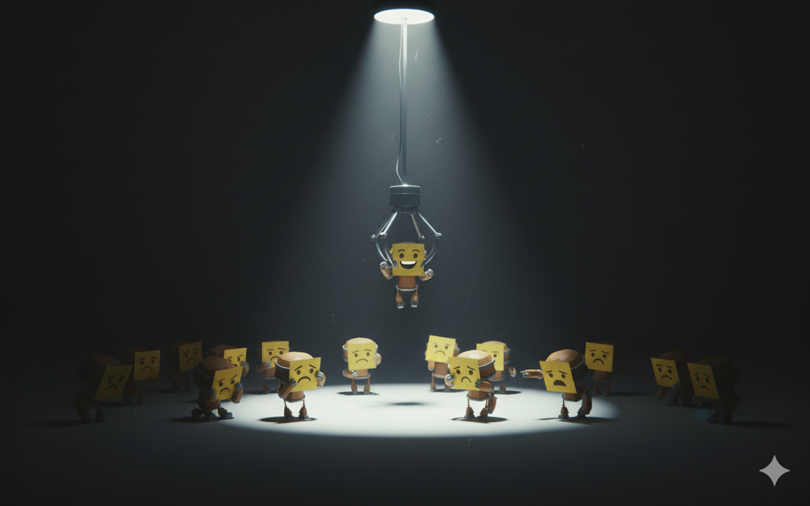
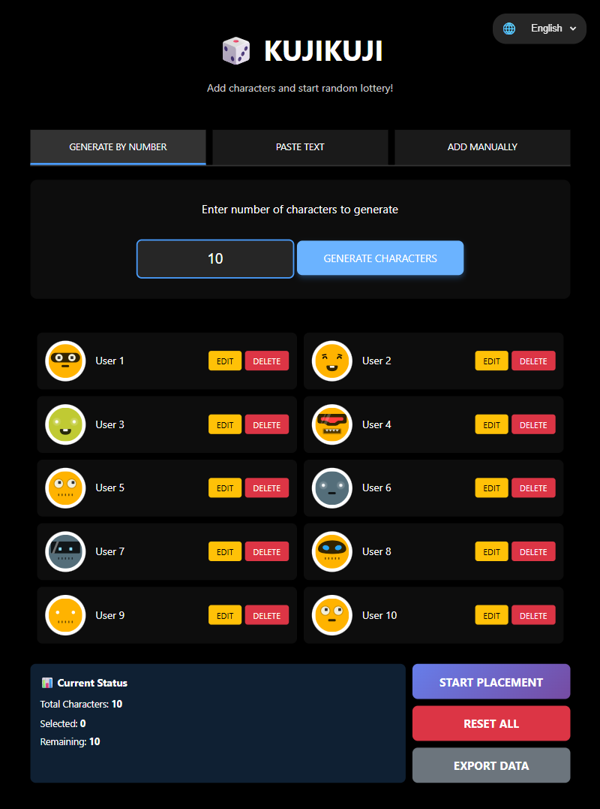
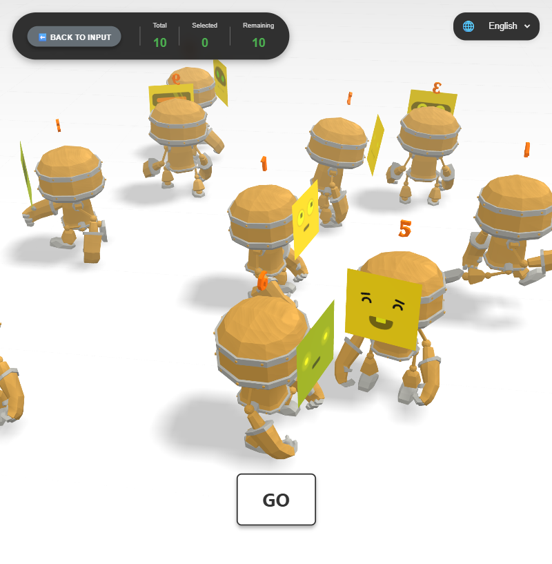
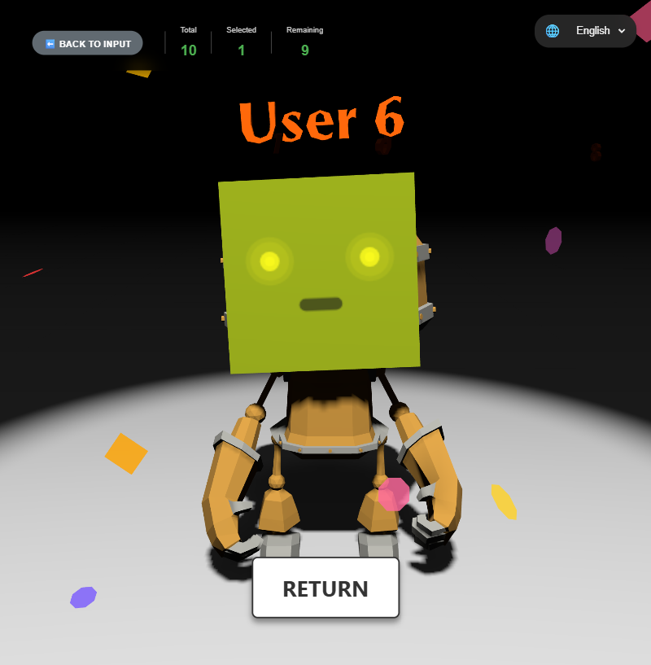

# 🎲 KUJIKUJI - 인터랙티브 3D 추첨

**KUJI (くじ)** 는 일본어로 "추첨" 또는 "뽑기"를 의미합니다. 애니메이션 로봇 캐릭터, 시네마틱 효과, 부드러운 전환이 특징인 인터랙티브 3D 추첨 애플리케이션입니다.

🎮 **[라이브 데모](https://siriz.github.io/kujikuji/)** | 📖 **다른 언어로 읽기**: [English](README.md) | [日本語](README.ja.md)


*Google Gemini (Nano Banana)로 생성된 컨셉 이미지*


## ✨ 주요 기능

- 🎭 **3D 애니메이션 캐릭터** - 랜덤 애니메이션이 있는 인터랙티브 로봇 모델
- 🎲 **랜덤 추첨 시스템** - 극적인 연출과 함께하는 공정한 추첨
- ✨ **파티클 효과** - 황금빛 폭발, 반짝임, 불꽃놀이 축하 효과
- 📸 **고유한 아바타** - DiceBear 통합으로 각 캐릭터마다 고유한 아바타
- 💾 **자동 저장** - LocalStorage를 통한 진행 상황 자동 저장
- 📱 **반응형 디자인** - 데스크톱과 모바일 모두 지원
- 🎬 **시네마틱 전환** - 부드러운 카메라 움직임과 조명 효과
- 📊 **진행 상황 추적** - 실시간 통계 표시
- 🌐 **다국어 지원** - 영어, 일본어(日本語), 한국어 지원 및 URL 파라미터 지원

## 🌐 언어 지원

KUJIKUJI는 자동 감지 및 저장 기능이 있는 3개 언어를 지원합니다:

### 지원 언어

- 🇺🇸 **영어(English)** (기본)
- 🇯🇵 **일본어(日本語)**
- 🇰🇷 **한국어**

### 언어 변경 방법

#### 방법 1: 언어 선택기 사용

화면 우측 상단의 언어 드롭다운(🌐)을 클릭하여 원하는 언어를 선택하세요. 선택한 언어는 localStorage에 자동으로 저장됩니다.

#### 방법 2: URL 파라미터 사용

URL 파라미터를 통해 직접 언어를 설정할 수 있습니다:

```
# 영어
http://localhost:8000/index.html?lang=en

# 일본어
http://localhost:8000/index.html?lang=ja

# 한국어
http://localhost:8000/index.html?lang=ko
```

이 방법은 `index.html`과 `select.html` 페이지 모두에서 작동합니다.

### 번역 범위

모든 UI 요소가 완전히 번역되어 있습니다:
- 페이지 제목과 헤더
- 입력 방법 탭과 레이블
- 버튼과 액션
- 통계 및 진행 상황 표시
- 알림 메시지
- 확인 대화상자

### 구현 세부사항

- **번역 파일**: `locales/translations.json` - JSON 기반 번역 시스템
- **i18n 모듈**: `js/i18n.js` - 언어 로딩, 전환, DOM 업데이트 처리
- **저장**: 언어 설정은 localStorage에 `preferredLanguage`로 저장됨
- **동적 업데이트**: 언어 변경 시 모든 텍스트 콘텐츠가 즉시 업데이트됨
- **속성**: 자동 번역을 위해 `data-i18n` 및 `data-i18n-placeholder` 속성 사용

## 🎮 사용 방법

### 1단계: 캐릭터 추가 (`index.html`)



세 가지 입력 방법 중 하나를 선택하세요:

1. **숫자로 생성**: 1~50 사이의 숫자를 입력하여 "User 1", "User 2" 등의 이름으로 캐릭터 자동 생성
2. **텍스트 붙여넣기**: Excel이나 텍스트 파일에서 이름을 복사하여 붙여넣기 (한 줄에 하나씩)
3. **직접 추가**: "+ 추가" 버튼을 클릭하여 캐릭터를 하나씩 추가

각 캐릭터는 DiceBear에서 제공하는 고유한 로봇 아바타를 받습니다. 시작하기 전에 이름을 수정하거나 캐릭터를 삭제할 수 있습니다.

### 2단계: 추첨 시작 (`select.html`)



1. **"배치 시작하기"** 버튼을 클릭하여 3D 장면으로 이동
2. 캐릭터들이 원형 패턴으로 무작위 배치됨
3. 카메라가 부드럽게 하강하여 모든 캐릭터를 보여줌
4. 캐릭터들이 랜덤 애니메이션을 수행하는 모습 관찰

### 3단계: 선택하기



1. **"GO"** 버튼을 클릭하여 랜덤으로 캐릭터 선택
2. 극적인 연출 감상:
   - 배경이 어두워짐
   - 스포트라이트가 당첨자에게 집중됨
   - 파티클 효과 폭발
   - 캐릭터가 감정 표현 수행
   - 이름 카드가 뒤집혀 신원 공개

3. **"RETURN"** 버튼을 클릭하여 전체 보기로 돌아가기
4. 모든 캐릭터가 선택될 때까지 반복

### 4단계: 완료

- 진행 상황은 좌측 상단에서 추적됨
- 모든 캐릭터가 선택되면 재시작 여부를 묻는 메시지 표시
- 모든 데이터는 세션 간에 localStorage에 유지됨

## 🚀 시작하기

### 사전 요구사항

- WebGL을 지원하는 최신 웹 브라우저
- LocalStorage 활성화
- 로컬 웹 서버 (또는 아래 방법 사용)

### 설치 방법

1. 저장소 클론:
```bash
git clone https://github.com/siriz/kujikuji.git
cd kujikuji
```

2. 로컬 웹 서버를 사용하여 파일 제공:

**방법 1: Python 사용**
```bash
# Python 3
python -m http.server 8000

# Python 2
python -m SimpleHTTPServer 8000
```

**방법 2: Node.js 사용**
```bash
npx http-server
```

**방법 3: VS Code 사용**
- "Live Server" 확장 프로그램 설치
- `index.html`을 우클릭하고 "Open with Live Server" 선택

3. 브라우저를 열고 다음 주소로 이동:
```
http://localhost:8000
```

## 📁 프로젝트 구조

```
kujikuji/
├── index.html          # 캐릭터 입력 화면 (진입점)
├── select.html         # 메인 3D 추첨 선택 장면
├── test/
│   └── robot.html     # 아바타 위치 조정 디버그 도구
├── css/
│   ├── main.css                # 전역 스타일시트
│   ├── select.css              # 선택 페이지 전용 스타일
│   └── language-selector.css   # 언어 선택기 드롭다운 스타일
├── js/
│   ├── main.js        # 메인 3D 장면 로직
│   ├── storage.js     # LocalStorage 데이터 관리
│   ├── utils.js       # 유틸리티 함수 (위치 지정, 충돌 감지)
│   ├── particles.js   # 파티클 효과 시스템
│   └── i18n.js        # 국제화 시스템
├── locales/
│   └── translations.json       # 다국어 번역 (en/ja/ko)
├── libs/
│   ├── gsap/
│   │   └── gsap.min.js    # GSAP 애니메이션 라이브러리 (로컬)
│   └── threejs/       # Three.js 라이브러리 파일
│       ├── build/
│       │   └── three.module.js
│       └── jsm/       # Three.js 애드온 및 유틸리티
│           ├── controls/      # OrbitControls
│           ├── loaders/       # GLTFLoader, FontLoader
│           ├── geometries/    # TextGeometry
│           └── libs/          # Stats, GUI
│   ├── models/        # 3D 모델 파일
│   │   └── gltf/
│   │       └── RobotExpressive/
│   └── fonts/         # 3D 텍스트용 폰트 파일
│       └── optimer_bold.typeface.json
```

## 🛠️ 사용 기술

- **Three.js** - 3D 그래픽 라이브러리
- **GSAP** - 애니메이션 라이브러리
- **DiceBear API** - 아바타 생성
- **WebGL** - 하드웨어 가속 3D 렌더링
- **LocalStorage** - 클라이언트 측 데이터 저장
- **i18n System** - JSON 기반 국제화 (en/ja/ko)

*자세한 서드파티 라이브러리 정보 및 라이선스는 아래 [라이선스](#-라이선스) 섹션을 참조하세요.*

## 🔧 개발 및 디버깅

### 아바타 위치 조정 도구

로봇 아바타의 위치를 조정하고 싶은 개발자를 위해 디버그 도구를 제공합니다:

**위치**: `test/robot.html`

**기능**:
- 실시간 아바타 위치 조정 (X, Y, Z 0.001 정밀도)
- 회전 컨트롤 (X, Y, Z 0.1° 정밀도)
- 50단계 실행 취소/다시 실행 시스템
- Head_3 본에 대한 시각적 와이어프레임 헬퍼
- 즉각적인 피드백이 있는 인터랙티브 컨트롤

**사용법**:
```bash
# 로컬 서버 시작 (이미 실행 중이 아닌 경우)
python -m http.server 8000

# 브라우저에서 열기
http://localhost:8000/test/robot.html
```

슬라이더와 입력 필드를 사용하여 아바타 평면의 위치와 회전을 미세 조정하세요. 변경 사항은 버튼이나 키보드 단축키(Ctrl+Z / Ctrl+Y)를 사용하여 실행 취소/다시 실행할 수 있습니다.

## 🎨 커스터마이징

### 나만의 캐릭터 이름 추가하기

1. `index.html` 열기
2. 세 가지 입력 방법 중 하나 사용
3. 캐릭터는 자동으로 localStorage에 저장됨

### 시각 효과 조정하기

`js/particles.js`를 편집하여 파티클 효과를 커스터마이징할 수 있습니다. 사용 가능한 효과:

#### 1. **컨페티 폭발** 🎊 (신규!)
중앙에서 폭죽처럼 터지는 다채로운 색종이:
```javascript
ParticleEffects.createConfettiBurst(scene, position, {
    particleCount: 150,
    explosionForce: 0.4,
    duration: 4.5
});
```

#### 2. **컨페티 레인** 🌧️ (신규!)
하늘에서 하늘하늘 흔들리며 떨어지는 색종이:
```javascript
ParticleEffects.createConfettiRain(scene, camera, {
    particleCount: 120,
    duration: 6,
    fallSpeed: 0.025
});
```

#### 3. **풀 셀레브레이션** 🎉 (신규!)
폭발 + 레인 조합으로 최고의 축하 연출:
```javascript
ParticleEffects.createConfettiCelebration(scene, position, camera);
```

#### 4. **선택 효과** ✨
나선형 움직임의 황금빛 파티클:
```javascript
ParticleEffects.createSelectionEffect(scene, position, {
    particleCount: 100,  // 더 많은 파티클
    color: 0xFF0000,     // 빨간색 파티클
    duration: 3          // 더 긴 애니메이션
});
```

#### 5. **폭죽 효과** 🎆
중력이 작용하는 폭발 파티클:
```javascript
ParticleEffects.createFireworkEffect(scene, position, {
    particleCount: 120,
    explosionForce: 0.3
});
```

### 새로운 컨페티 효과 테스트하기

모든 컨페티 효과를 테스트할 수 있는 전용 데모 페이지가 제공됩니다:

**위치**: `test/confetti-demo.html`

**기능**:
- 💥 **컨페티 폭발**: 폭죽 스타일 폭발
- 🌧️ **컨페티 레인**: 부드러운 낙하 움직임
- 🎊 **풀 셀레브레이션**: 폭발 + 레인 조합
- ✨ **클래식 효과**: 기존 파티클 시스템

**사용법**:
```bash
# 브라우저에서 열기
http://localhost:8000/test/confetti-demo.html
```

화려한 버튼들을 클릭하여 다양한 효과를 발동시키세요. 여러 번 클릭하여 효과를 중첩시키면 더욱 화려한 축하 연출이 가능합니다!


### 위치 지정 알고리즘 변경하기

`js/utils.js` → `generatePositions()` 수정:
- 간격을 위한 `minDistance` 조정
- 레이어 간격 변경
- 원형/나선형 패턴 수정

## 📊 데이터 관리

### LocalStorage 구조

```json
{
  "characters": [
    {
      "id": "unique-id",
      "name": "Character Name",
      "avatarSeed": "random-seed",
      "selected": false,
      "selectedAt": null,
      "createdAt": "2025-10-26T..."
    }
  ],
  "selectedCharacters": [],
  "createdAt": "2025-10-26T...",
  "updatedAt": "2025-10-26T..."
}
```

### 데이터 작업

- **내보내기**: "데이터 내보내기" 버튼을 클릭하여 JSON 백업 다운로드
- **초기화**: 모든 데이터 삭제 및 새로 시작
- **저장**: 각 작업 후 데이터 자동 저장

## 🎭 애니메이션 상태

로봇은 다양한 애니메이션 상태를 지원합니다:

- **상태**: Idle, Walking, Running, Dance, Sitting, Standing, Death
- **감정 표현**: Jump, Yes, No, Wave, Punch, ThumbsUp

선택되지 않은 캐릭터들은 이러한 애니메이션을 랜덤으로 수행합니다.

## 📱 브라우저 호환성

- Chrome (권장)
- Firefox
- Safari
- Edge
- Opera

**참고**: WebGL 지원이 필요합니다. 일부 오래된 브라우저나 기기는 호환되지 않을 수 있습니다.

## 🤝 기여하기

기여를 환영합니다! 자유롭게:

1. 저장소 포크
2. 기능 브랜치 생성 (`git checkout -b feature/AmazingFeature`)
3. 변경사항 커밋 (`git commit -m 'Add some AmazingFeature'`)
4. 브랜치에 푸시 (`git push origin feature/AmazingFeature`)
5. Pull Request 열기

## 📄 라이선스

이 프로젝트는 MIT 라이선스에 따라 라이선스가 부여됩니다. 자세한 내용은 [LICENSE](LICENSE) 파일을 참조하세요.

### 서드파티 라이선스

이 프로젝트는 다음 외부 라이브러리 및 자산을 사용하며, 각각 고유한 라이선스를 가지고 있습니다:

#### Three.js (MIT License)
- **위치**: `libs/threejs/`
- **라이선스**: MIT License
- **URL**: https://threejs.org/
- **저작권**: Copyright © 2010-2024 Three.js authors

#### GSAP (GreenSock Animation Platform)
- **위치**: `libs/gsap/`
- **라이선스**: GreenSock Standard License (대부분의 사용 사례에서 무료)
- **URL**: https://greensock.com/licensing/
- **참고**: 상업 프로젝트는 라이선스가 필요할 수 있음

#### RobotExpressive 3D Model
- **위치**: `libs/models/gltf/RobotExpressive/`
- **출처**: Three.js Examples
- **라이선스**: MIT License (Three.js examples의 일부)
- **URL**: https://github.com/mrdoob/three.js/tree/master/examples/models/gltf

#### MgOpen Fonts (Optimer, Helvetiker)
- **위치**: `libs/fonts/`
- **라이선스**: MgOpen License (상업적 및 비상업적 사용 무료)
- **URL**: http://www.ellak.gr/fonts/MgOpen/
- **저작권**: Copyright (c) 2004 by MAGENTA Ltd.
- **참고**: 사용, 복사, 병합, 게시, 배포 무료

#### DiceBear Avatars API
- **서비스**: 아바타 생성 (외부 API)
- **라이선스**: 개인 및 상업적 사용 무료
- **URL**: https://www.dicebear.com/
- **사용 스타일**: bottts-neutral

모든 서드파티 구성 요소는 원래 라이선스를 유지합니다. 전체 라이선스 텍스트는 `libs/` 디렉터리의 각 라이선스 파일을 참조하세요.

## 🙏 감사의 말

- 놀라운 3D 라이브러리와 예제를 제공한 Three.js 팀
- 부드러운 애니메이션 프레임워크를 제공한 GSAP 팀
- Three.js 예제의 로봇 모델 (RobotExpressive)
- 아름다운 서체를 제공한 MgOpen Fonts 프로젝트
- 아바타 생성 API를 제공한 DiceBear

## 📧 연락처

siriz - [@siriz](https://github.com/siriz)

프로젝트 링크: [https://github.com/siriz/kujikuji](https://github.com/siriz/kujikuji)

---

Made with ❤️ and Three.js
