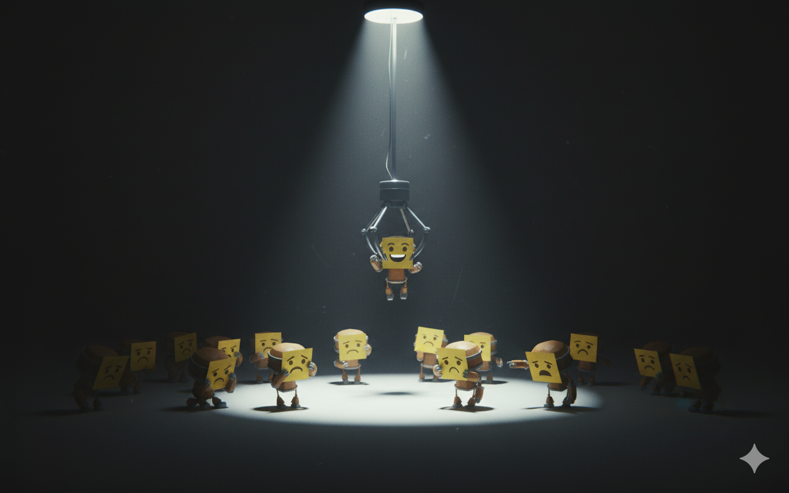
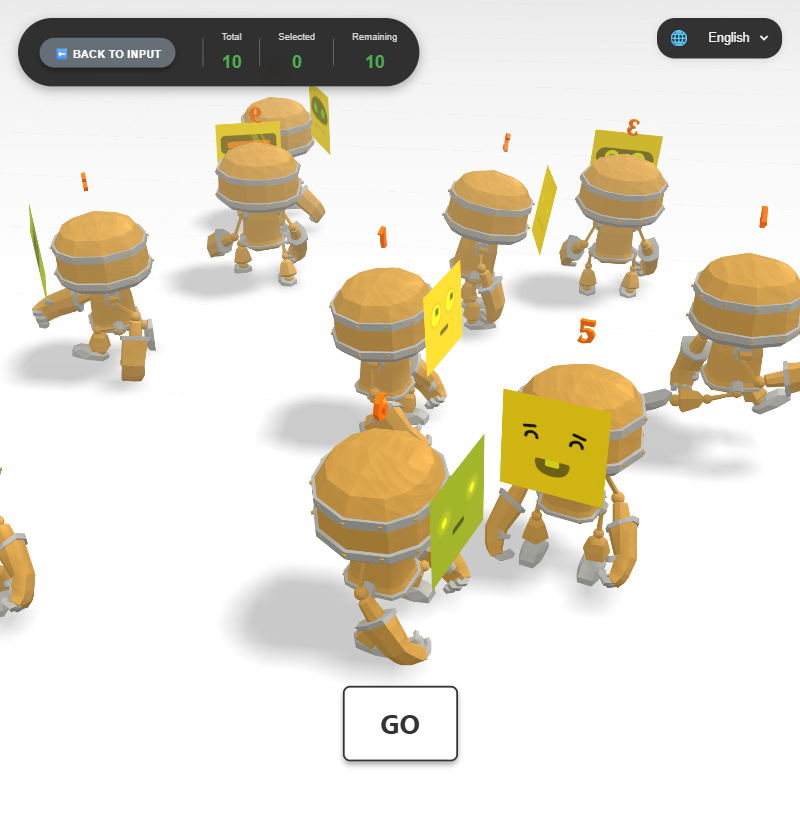

# 🎲 KUJIKUJI - Interactive 3D Lottery

**KUJI (くじ)** means "lottery" in Japanese. An interactive 3D lottery application with animated robot characters, cinematic effects, and smooth transitions.

🎮 **[Live Demo](https://siriz.github.io/kujikuji/)** | 📖 **Read this in other languages**: [한국어](README.ko.md) | [日本語](README.ja.md)


*Concept image generated by Google Gemini (Nano Banana)*


## ✨ Features

- 🎭 **3D Animated Characters** - Interactive robot models with random animations
- 🎲 **Random Lottery System** - Fair selection with dramatic reveals
- ✨ **Particle Effects** - Gold bursts, sparkles, and firework celebrations
- 📸 **Unique Avatars** - DiceBear integration for each character
- 💾 **Auto-Save** - LocalStorage persistence for progress tracking
- 📱 **Responsive Design** - Works on desktop and mobile
- 🎬 **Cinematic Transitions** - Smooth camera movements and lighting effects
- 📊 **Progress Tracking** - Real-time statistics display
- 🌐 **Multi-Language Support** - English, Japanese (日本語), Korean (한국어) with URL parameter support

## 🌐 Language Support

KUJIKUJI supports three languages with automatic detection and persistence:

### Supported Languages

- 🇺🇸 **English** (default)
- 🇯🇵 **Japanese (日本語)**
- 🇰🇷 **Korean (한국어)**

### How to Change Language

#### Method 1: Using the Language Selector

Click the language dropdown (🌐) in the top-right corner of any page and select your preferred language. Your choice is automatically saved to localStorage.

#### Method 2: Using URL Parameters

You can set the language directly via URL parameters:

```
# English
http://localhost:8000/index.html?lang=en

# Japanese
http://localhost:8000/index.html?lang=ja

# Korean
http://localhost:8000/index.html?lang=ko
```

This works on both `index.html` and `select.html` pages.

### Implementation Details

- **Translation Files**: `locales/translations.json` - JSON-based translation system
- **i18n Module**: `js/i18n.js` - Handles language loading, switching, and DOM updates
- **Persistence**: Language preference is saved to localStorage as `preferredLanguage`
- **Dynamic Updates**: All text content updates instantly when language changes
- **Attributes**: Uses `data-i18n` and `data-i18n-placeholder` attributes for automatic translation

## 🎮 How to Use

### Step 1: Add Characters (`index.html`)


Choose one of three input methods:

1. **Number Generation**: Enter a number (1-50) to auto-generate characters named "User 1", "User 2", etc.
2. **Text Paste**: Copy and paste names from Excel or a text file (one name per line)
3. **Manual Addition**: Click the "+ Add" button to add characters one by one

Each character gets a unique robot avatar from DiceBear. You can edit names or delete characters before starting.

### Step 2: Start the Lottery (`select.html`)



1. Click the **"Start"** button to proceed to the 3D scene
2. Characters are randomly arranged in a circular pattern
3. The camera smoothly descends to reveal all characters
4. Watch as characters perform random animations

### Step 3: Make Selections


1. Click the **"GO"** button to randomly select a character
2. Enjoy the dramatic reveal:
   - Background darkens
   - Spotlight focuses on the winner
   - Particle effects burst
   - Character performs emotes
   - Name card flips to reveal identity

3. Click **"RETURN"** to go back to the overview
4. Repeat until all characters are selected

### Step 4: Completion

- Progress is tracked in the top-left corner
- When all characters are selected, you'll be prompted to restart
- All data persists in localStorage between sessions

## 🚀 Getting Started

### Prerequisites

- A modern web browser with WebGL support
- LocalStorage enabled
- Local web server (or use the methods below)

### Installation

1. Clone the repository:
```bash
git clone https://github.com/siriz/kujikuji.git
cd kujikuji
```

2. Serve the files using a local web server:

**Option 1: Using Python**
```bash
# Python 3
python -m http.server 8000

# Python 2
python -m SimpleHTTPServer 8000
```

**Option 2: Using Node.js**
```bash
npx http-server
```

**Option 3: Using VS Code**
- Install the "Live Server" extension
- Right-click on `index.html` and select "Open with Live Server"

3. Open your browser and navigate to:
```
http://localhost:8000
```

## 📁 Project Structure

```
kujikuji/
├── index.html          # Character input screen (entry point)
├── select.html         # Main 3D lottery selection scene
├── test/
│   └── robot.html     # Debug tool for avatar positioning
├── css/
│   ├── main.css                # Global stylesheet
│   ├── select.css              # Select page specific styles
│   └── language-selector.css   # Language selector dropdown styles
├── js/
│   ├── main.js        # Main 3D scene logic
│   ├── storage.js     # LocalStorage data management
│   ├── utils.js       # Utility functions (positioning, collision detection)
│   ├── particles.js   # Particle effect system
│   └── i18n.js        # Internationalization system
├── locales/
│   └── translations.json       # Multi-language translations (en/ja/ko)
├── libs/
│   ├── gsap/
│   │   └── gsap.min.js    # GSAP animation library (local)
│   └── threejs/       # Three.js library files
│       ├── build/
│       │   └── three.module.js
│       └── jsm/       # Three.js addons and utilities
│           ├── controls/      # OrbitControls
│           ├── loaders/       # GLTFLoader, FontLoader
│           ├── geometries/    # TextGeometry
│           └── libs/          # Stats, GUI
│       ├── models/            # 3D model files
│       │   └── gltf/
│       │       └── RobotExpressive/
│       └── fonts/             # Font files for 3D text
│           └── optimer_bold.typeface.json
├── models/            # 3D model files
│   └── gltf/
│       └── RobotExpressive/
└── fonts/             # Font files for 3D text
    └── optimer_bold.typeface.json
```

## 🛠️ Technologies Used

- **Three.js** - 3D graphics library
- **GSAP** - Animation library
- **DiceBear API** - Avatar generation
- **WebGL** - Hardware-accelerated 3D rendering
- **LocalStorage** - Client-side data persistence
- **i18n System** - JSON-based internationalization (en/ja/ko)

*See the [License](#-license) section below for detailed third-party library information and licenses.*

## 🔧 Development & Debugging

### Avatar Positioning Tool

For developers who want to adjust the robot avatar positioning, we provide a debug tool:

**Location**: `test/robot.html`

**Features**:
- Real-time avatar position adjustment (X, Y, Z with 0.001 precision)
- Rotation controls (X, Y, Z with 0.1° precision)
- 50-state undo/redo system
- Visual wireframe helpers for Head_3 bone
- Interactive controls with immediate feedback

**Usage**:
```bash
# Start local server (if not already running)
python -m http.server 8000

# Open in browser
http://localhost:8000/test/robot.html
```

Use the sliders and input fields to fine-tune the avatar plane position and rotation. Changes can be undone/redone using the buttons or keyboard shortcuts (Ctrl+Z / Ctrl+Y).

## 🎨 Customization

### Adding Your Own Character Names

1. Open `index.html`
2. Use any of the three input methods
3. Characters are automatically saved to localStorage

### Adjusting Visual Effects

Edit `js/particles.js` to customize particle effects. Available effects:

#### 1. **Confetti Burst** 🎊 (NEW!)
Colorful confetti pieces exploding from the center like fireworks:
```javascript
ParticleEffects.createConfettiBurst(scene, position, {
    particleCount: 150,
    explosionForce: 0.4,
    duration: 4.5
});
```

#### 2. **Confetti Rain** 🌧️ (NEW!)
Confetti falling gently from the sky with swaying motion:
```javascript
ParticleEffects.createConfettiRain(scene, camera, {
    particleCount: 120,
    duration: 6,
    fallSpeed: 0.025
});
```

#### 3. **Full Celebration** 🎉 (NEW!)
Combined effect with burst + rain for maximum celebration:
```javascript
ParticleEffects.createConfettiCelebration(scene, position, camera);
```

#### 4. **Selection Effect** ✨
Rising golden particles with spiral motion:
```javascript
ParticleEffects.createSelectionEffect(scene, position, {
    particleCount: 100,  // More particles
    color: 0xFF0000,     // Red particles
    duration: 3          // Longer animation
});
```

#### 5. **Firework Effect** 🎆
Explosive particle bursts with gravity:
```javascript
ParticleEffects.createFireworkEffect(scene, position, {
    particleCount: 120,
    explosionForce: 0.3
});
```

### Test the New Confetti Effects

A dedicated demo page is available to test all confetti effects:

**Location**: `test/confetti-demo.html`

**Features**:
- 💥 **Confetti Burst**: Firework-style explosion
- 🌧️ **Confetti Rain**: Gentle falling motion
- 🎊 **Full Celebration**: Combined burst + rain
- ✨ **Classic Effects**: Original particle system

**Usage**:
```bash
# Open in browser
http://localhost:8000/test/confetti-demo.html
```

Click the colorful buttons to trigger different effects. You can click multiple times to layer effects for spectacular celebrations!


### Changing Positioning Algorithm

Modify `js/utils.js` → `generatePositions()`:
- Adjust `minDistance` for spacing
- Change layer spacing
- Modify circular/spiral patterns

## 📊 Data Management

### LocalStorage Structure

```json
{
  "characters": [
    {
      "id": "unique-id",
      "name": "Character Name",
      "avatarSeed": "random-seed",
      "selected": false,
      "selectedAt": null,
      "createdAt": "2025-10-26T..."
    }
  ],
  "selectedCharacters": [],
  "createdAt": "2025-10-26T...",
  "updatedAt": "2025-10-26T..."
}
```

### Data Operations

- **Export**: Click the "Export Data" button to download JSON backup
- **Reset**: Clear all data and start fresh
- **Persist**: Data automatically saves after each action

## 🎭 Animation States

The robots support various animation states:

- **States**: Idle, Walking, Running, Dance, Sitting, Standing, Death
- **Emotes**: Jump, Yes, No, Wave, Punch, ThumbsUp

Characters randomly perform these animations when not selected.

## 📱 Browser Compatibility

- Chrome (recommended)
- Firefox
- Safari
- Edge
- Opera

**Note**: Requires WebGL support. Some older browsers or devices may not be compatible.

## 🤝 Contributing

Contributions are welcome! Feel free to:

1. Fork the repository
2. Create a feature branch (`git checkout -b feature/AmazingFeature`)
3. Commit your changes (`git commit -m 'Add some AmazingFeature'`)
4. Push to the branch (`git push origin feature/AmazingFeature`)
5. Open a Pull Request

## 📄 License

This project is licensed under the MIT License - see the [LICENSE](LICENSE) file for details.

### Third-Party Licenses

This project uses the following external libraries and assets, each with their own licenses:

#### Three.js (MIT License)
- **Location**: `libs/threejs/`
- **License**: MIT License
- **URL**: https://threejs.org/
- **Copyright**: Copyright © 2010-2024 Three.js authors

#### GSAP (GreenSock Animation Platform)
- **Location**: `libs/gsap/`
- **License**: GreenSock Standard License (free for most use cases)
- **URL**: https://greensock.com/licensing/
- **Note**: Commercial projects may require a license

#### RobotExpressive 3D Model
- **Location**: `libs/models/gltf/RobotExpressive/`
- **Source**: Three.js Examples
- **License**: MIT License (as part of Three.js examples)
- **URL**: https://github.com/mrdoob/three.js/tree/master/examples/models/gltf

#### MgOpen Fonts (Optimer, Helvetiker)
- **Location**: `libs/fonts/`
- **License**: MgOpen License (Free for commercial and non-commercial use)
- **URL**: http://www.ellak.gr/fonts/MgOpen/
- **Copyright**: Copyright (c) 2004 by MAGENTA Ltd.
- **Note**: Free to use, copy, merge, publish, and distribute

#### DiceBear Avatars API
- **Service**: Avatar generation (external API)
- **License**: Free for personal and commercial use
- **URL**: https://www.dicebear.com/
- **Style Used**: bottts-neutral

All third-party components retain their original licenses. Please refer to their respective license files in the `libs/` directory for full license texts.

## 🙏 Acknowledgments

- Three.js team for the amazing 3D library and examples
- GSAP team for the smooth animation framework
- Robot model from Three.js examples (RobotExpressive)
- MgOpen Fonts project for beautiful typefaces
- DiceBear for the avatar generation API

## 📧 Contact

siriz - [@siriz](https://github.com/siriz)

Project Link: [https://github.com/siriz/kujikuji](https://github.com/siriz/kujikuji)

---

Made with ❤️ and Three.js
